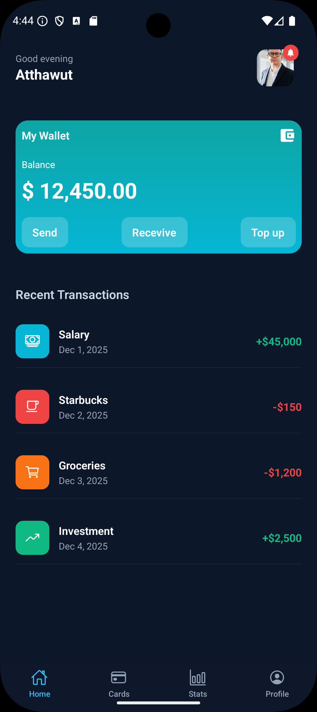
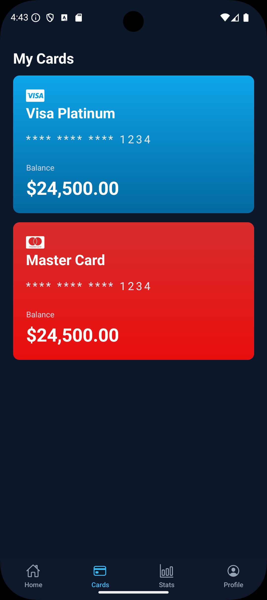
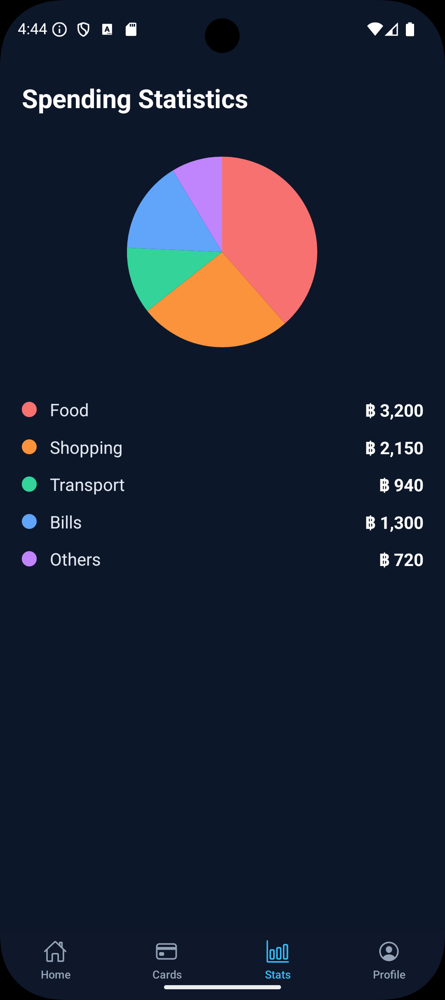
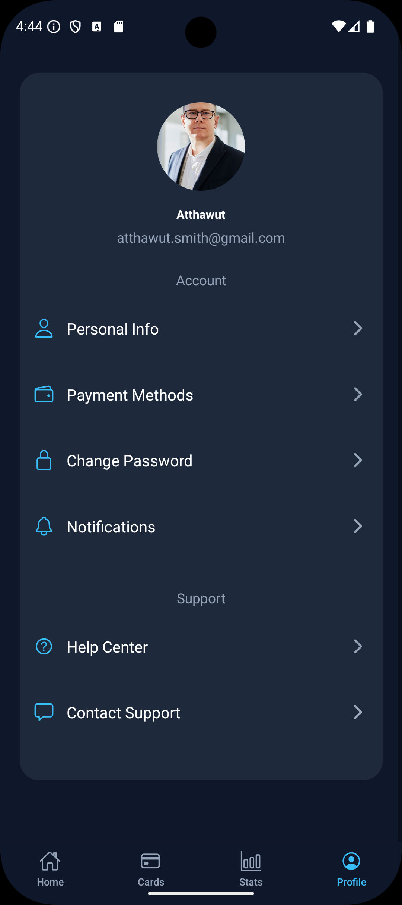

# 📱 Banking UI App -- React Native Expo

โปรเจคนี้เป็นงาน **ฝึกการออกแบบ UI ด้วย React Native + Expo**
โดยจำลองหน้าตาแอปธนาคาร (Banking App) ที่มีทั้งหมด 4 หน้า ได้แก่ Home,
Cards, Stats และ Profile

------------------------------------------------------------------------

## 🚀 Tech Stack

-   React Native
-   Expo
-   React Navigation (Stack + Bottom Tabs)
-   Expo Vector Icons

------------------------------------------------------------------------

## 📂 โครงสร้างหน้าตาของแอป

แอปนี้ประกอบด้วย 4 หน้า:

### 1️⃣ HomeScreen

-   แสดงยอดเงิน (Balance)
-   แสดงรายการเดินบัญชีล่าสุด
-   แสดงการ์ดของผู้ใช้

### 2️⃣ CardsScreen

-   แสดงบัตรทั้งหมดของผู้ใช้ เช่น Credit / Debit
-   UI การ์ดแบบสวยงาม

### 3️⃣ StatsScreen

-   แสดงสถิติการใช้เงิน เช่น รายรับ รายจ่าย
-   สามารถใส่กราฟเพิ่มเติมในภายหลังได้

### 4️⃣ ProfileScreen

-   ข้อมูลโปรไฟล์ผู้ใช้
-   ปุ่มตั้งค่าต่าง ๆ

------------------------------------------------------------------------

## 🧭 การติดตั้งโปรเจค

``` sh
npm install
npx run start
```

------------------------------------------------------------------------

## 🗂 Folder Structure (ตัวอย่าง)

    /assets
    /components
    /screens
      ├── HomeScreen.tsx
      ├── CardsScreen.tsx
      ├── StatsScreen.tsx
      └── ProfileScreen.tsx
    /navigation
    App.tsx

------------------------------------------------------------------------

## 🖼 ตัวอย่างหน้าจอ






------------------------------------------------------------------------

## 🎯 จุดประสงค์ของโปรเจค

-   ฝึกทำ UI 
-   ฝึก Navigation หลายหน้า
-   ฝึกการจัด layout ด้วย Flexbox
-   ฝึกสร้าง component แบบแยกใช้ซ้ำได้
